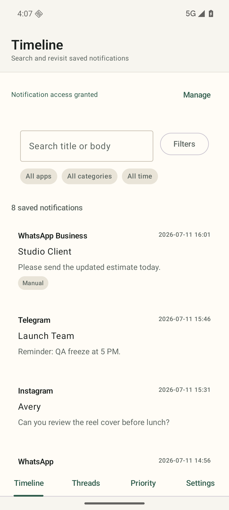
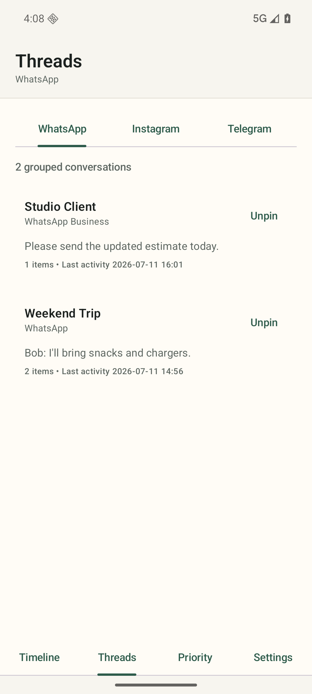
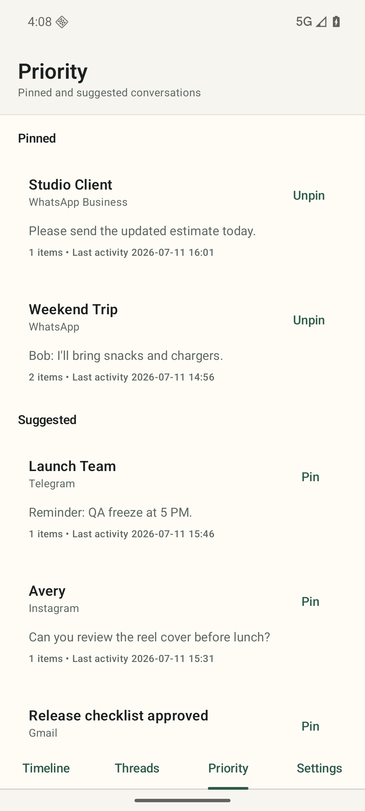

# Notification Saver

[](https://github.com/d3v4shish/NotificationSaver/actions/workflows/android-ci.yml)
[](https://github.com/d3v4shish/NotificationSaver/actions/workflows/release-build.yml)
[](LICENSE)

Notification Saver is a local-first Android app that captures incoming notifications on-device and lets you revisit them later through a searchable timeline, per-app conversation tabs, and a prioritized chat list.

<p align="center">
  
  
  
</p>

## Why It Exists

- Notification history stays on your device instead of being sent to a hosted backend.
- Messaging notifications are grouped into conversation threads inside app tabs for WhatsApp, Instagram, and Telegram.
- Important chats can be pinned, while the rest are surfaced in a local suggested-priority view.
- Cleanup, export, logs, crash reports, and storage usage are visible from the app UI.

## Highlights

- Timeline with search, app filters, category filters, and date filters
- Threaded conversation tabs for WhatsApp, Instagram, and Telegram
- Priority view with pinned and suggested conversations across apps
- Light, dark, and follow-system theme modes
- Privacy mode to hide previews in list views
- Retention controls and per-app category overrides
- Notification export and diagnostics export through the Android document picker
- Local log rotation, local crash reports, and visible operational counters
- First-run tutorial and notification-listener permission guidance

## Install

### Option 1: Download A Release

Use the latest signed APK from [GitHub Releases](https://github.com/d3v4shish/NotificationSaver/releases/latest).

### Option 2: Build Locally

Debug build:

```bash
./gradlew clean assembleDebug
adb install -r app/build/outputs/apk/debug/app-debug.apk
```

Release build:

```bash
cp keystore.properties.example keystore.properties
./gradlew clean assembleRelease
```

If signing values are configured through `keystore.properties` or the `ANDROID_KEYSTORE_*` environment variables, the release build will use them automatically.

## Privacy And Data Handling

- Captured notifications are stored locally in the app database.
- The app does not intentionally upload notification contents to remote services.
- Diagnostics bundles include app health metadata, logs, crash reports, and storage summaries.
- Diagnostics bundles intentionally exclude notification titles, bodies, big text, and database exports.

More detail:

- [Privacy Policy](docs/privacy.md)
- [Data Handling Notes](docs/data-handling.md)

## Verification

Core checks:

```bash
./gradlew clean lint testDebugUnitTest assembleDebug assembleRelease
./gradlew connectedDebugAndroidTest
```

GitHub Actions also runs:

- Android CI on pushes and pull requests
- Dependency review for pull requests
- CodeQL analysis
- Release packaging and publishing for version tags

## Project Docs

- [Contributing](CONTRIBUTING.md)
- [Security](SECURITY.md)
- [Changelog](CHANGELOG.md)
- [Releasing](RELEASING.md)
- [Screenshot Capture Checklist](docs/screenshot-capture.md)

## Notes

- Thread grouping depends on notification metadata exposed by each source app.
- The committed screenshots use the built-in debug demo dataset.
- `dist/landing-page/` is intentionally generated locally and ignored by Git.
